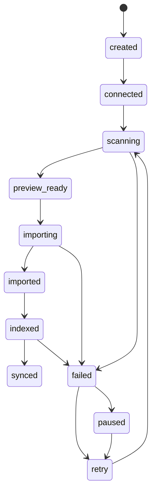
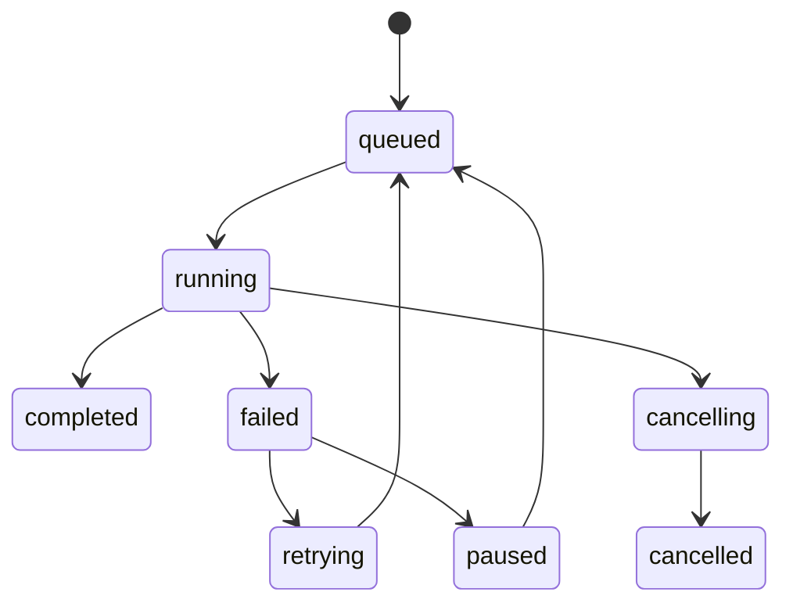
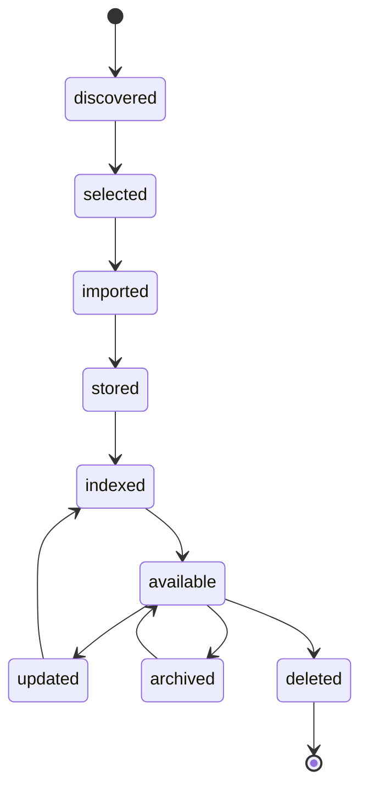

# Omni Source Import State Machines

Status: Draft for implementation

## Source Lifecycle

## Source Health States

- `connected`
- `scanning`
- `importing`
- `rate_limited`
- `auth_expired`
- `disconnected`
- `partially_synced`
- `error`
- `maintenance`

Health state describes operational condition. Lifecycle describes workflow position.

## Job Lifecycle

Job statuses:

- `queued`
- `running`
- `completed`
- `failed`
- `cancelling`
- `cancelled`
- `retrying`
- `paused`

## Content Lifecycle

Content states:

- `discovered`
- `selected`
- `imported`
- `stored`
- `indexed`
- `available`
- `updated`
- `archived`
- `deleted`

## Transition Rules

- A source may not enter `importing` unless a preview exists or selected discovery ids are provided.
- A job may be cancelled only from `queued` or `running`.
- Imported content may not skip directly from `discovered` to `available`.
- `deleted` content must not remain in Search Index after the next indexing pass.
- Health `rate_limited` should pause scan/sync jobs and preserve cursor state.
