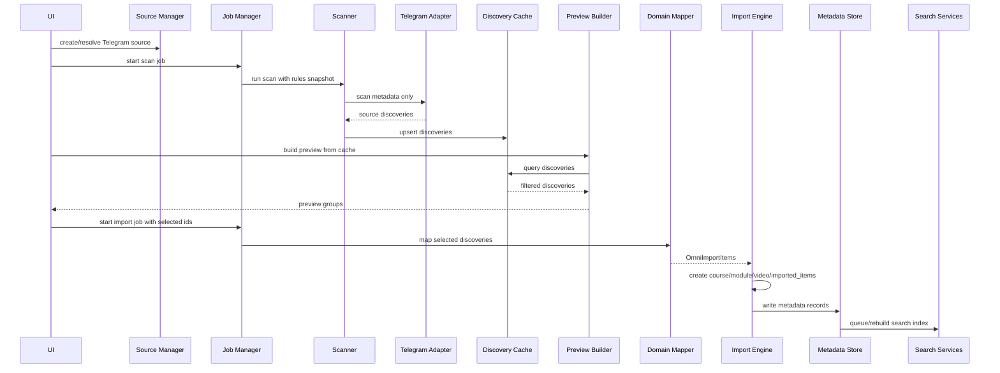
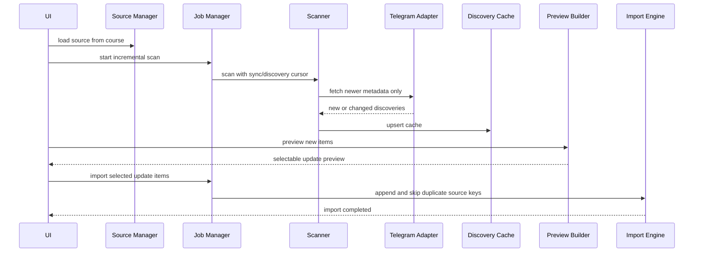
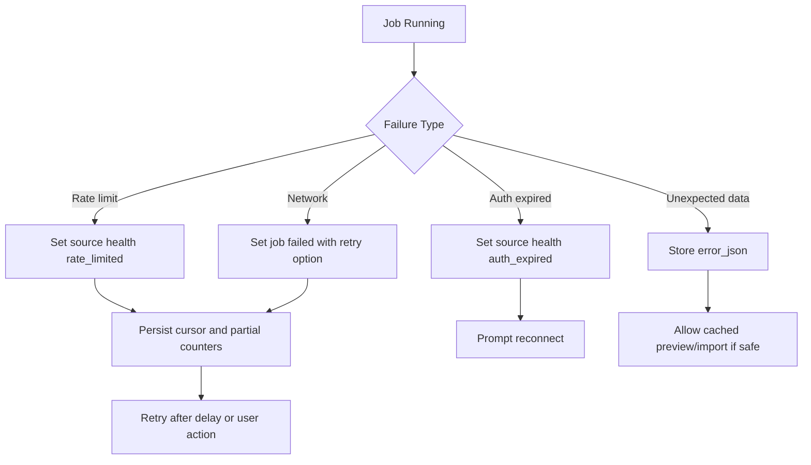
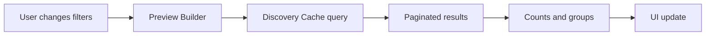

# Omni Source Import Workflow Diagrams

Status: Draft for implementation

## Initial Telegram Import

## Telegram Update

## Error Recovery

## Preview Filtering

Preview filtering must not trigger a new scan.
